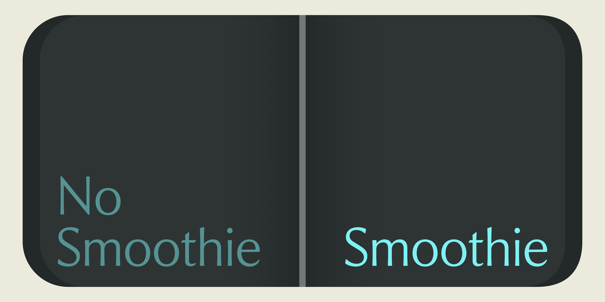
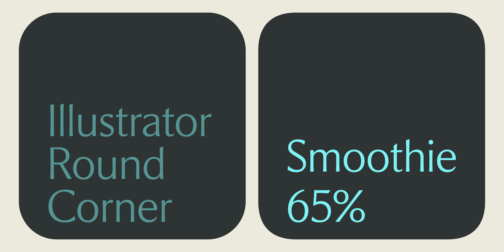
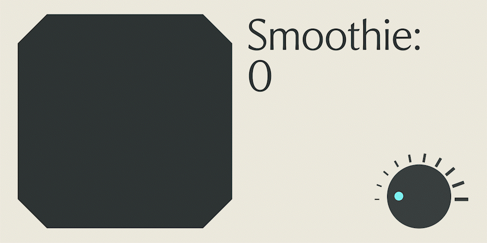

# Smoothie

Illustrator 的圓角特效外掛,用比例式的曲率邏輯做出比內建「圓角」效果更細膩、可調範圍更大的轉角平滑。

[](https://github.com/yonghanciou/Features/releases/latest)




## 支援版本

- 作業系統:macOS(核心開發平台,未測試 Windows)
- 軟體:Adobe Illustrator(以 Illustrator 2026 SDK 開發、實測)

## 曲率邏輯

半徑決定圓角多大,曲率(0–100%,預設 65%)決定圓角多「飽滿」:曲率愈低愈接近直線斜切,愈高圓角愈往轉角頂點延伸,不是 Illustrator 內建「圓角」效果那種固定的圓弧。

## 安裝方式

**不想自己編譯的話**,到 [Releases](https://github.com/yonghanciou/Features/releases) 下載編譯好的 `Smoothie-vX.X.X-macOS.zip`:

1. 解壓縮得到 `Smoothie.aip`(**不要雙擊它**——它不是應用程式,雙擊只會跳出「無法打開」,雙擊之後按「強制打開」也不會有反應,是正常的,直接跳下一步),移到 `/Applications/Adobe Illustrator [版本]/Plug-ins.localized/`。
2. 目前是 ad-hoc 簽章(不是正式 Apple Developer ID),重新啟動 Illustrator 時 macOS 可能會擋下這個外掛。如果 `效果` 選單裡沒有出現 `SFF Features`,擇一處理:
   - **系統設定**:打開「系統設定 > 隱私權與安全性」,捲到最下面應該會看到「已阻擋『Smoothie.aip』以保護你的 Mac」,按「強制打開」,跳出的確認視窗再按一次「打開」。
   - **終端機**(一次到位,不會再跳警告):
     ```bash
     xattr -d com.apple.quarantine "/Applications/Adobe Illustrator [版本]/Plug-ins.localized/Smoothie.aip"
     ```
3. 完全結束 Illustrator(⌘Q)再重新打開,`效果 > SFF Features > Smoothie...` 應該就會出現。

**自己編譯**:這個資料夾放的是外掛原始碼(`src/`),需要搭配 Adobe Illustrator C++ Plug-in SDK 自行編譯成 `.aip`。

**不想裝外掛**:`src/Smoothie.jsx` 是免安裝的獨立版本:Illustrator 的 `檔案 > 指令碼 > Smoothie.jsx` 就能直接對選取路徑套用平滑圓角(是破壞性的,不會出現在外觀面板裡回頭調整,只是輕量替代方案)。

## 使用方法

1. 選取一個路徑物件。
2. 執行 `效果 > SFF Features > Smoothie...`。
3. 在跳出的對話框裡調整:
   - **半徑**:數字欄位會照文件目前的尺標單位顯示(mm/pt/in/pica/cm/px 皆可),旁邊有上下箭頭可以點,欄位裡也能直接按 ↑/↓ 鍵增減(按住 Shift 是 10 倍)。
   - **曲率**:0%–100% 滑桿,預設 65%,一樣支援方向鍵增減。
   - **預視**:勾選後拖曳滑桿畫布會即時更新。
4. 按「確定」套用。效果會留在「外觀」面板裡,之後可以隨時雙擊再打開這個對話框重新調整參數。





## 已知問題

- 只在 macOS 上開發與測試,尚未驗證 Windows。
- 半徑在很短的邊上會被自動夾住(避免圓角互相重疊或超出相鄰邊),不是 bug。
- 目前只在 Illustrator 2026 上實際測試過,其他版本理論相容但未逐一驗證。

## 更新紀錄

- v1.0 — 初版:比例式曲率演算法、原生 Cocoa 對話框(半徑跟隨文件單位、方向鍵/上下箭頭增減、即時預視)、獨立 ExtendScript 輕量版。
