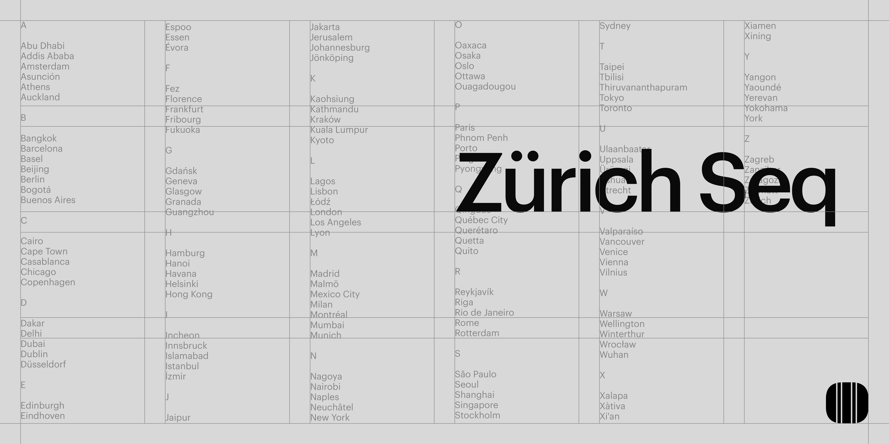
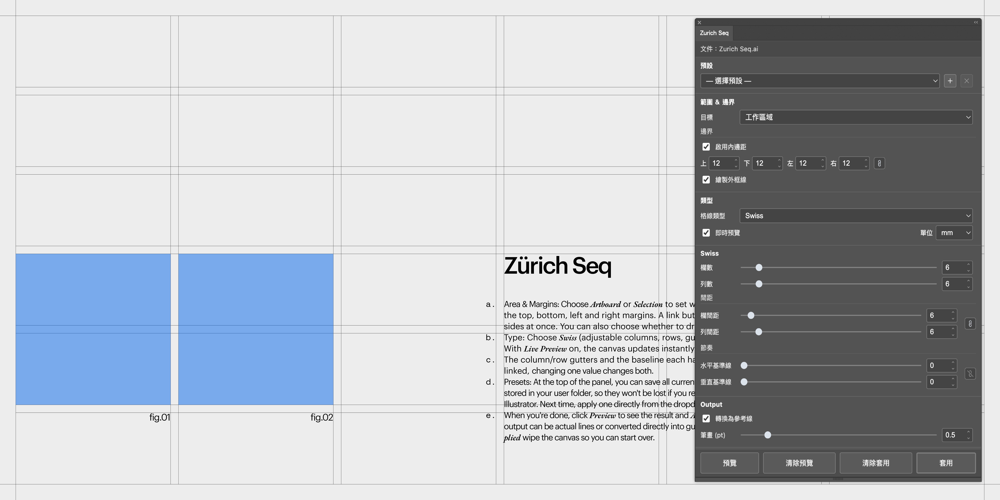

# Zurich Seq

Illustrator 的網格/輔助線產生器,支援 Swiss 風格網格與等分網格兩種類型,常用設定可以存成預設隨時套用。

[](https://github.com/yonghanciou/Features/releases/tag/v1.0.0-zurich-seq)



## 支援版本

- 作業系統:macOS(核心開發平台,未測試 Windows)
- 軟體:Adobe Illustrator(CEP 11 以上,實測於 Illustrator 2026)

## 安裝方式

這是一個 Adobe CEP 擴充功能(不是 `.aip` 外掛),目前未經 Adobe 簽章,需要先開啟 Illustrator 的「擴充功能除錯模式」才能載入。

1. 到 [Releases](https://github.com/yonghanciou/Features/releases/tag/v1.0.0-zurich-seq) 下載 `ZurichSeq-v1.0.0-macOS.zip` 並解壓縮(或直接用這個資料夾裡的 `src/`),把整包複製到:
   ```
   ~/Library/Application Support/Adobe/CEP/extensions/
   ```
   (資料夾名稱不拘,但複製進去後裡面要直接看到 `CSXS/manifest.xml`、`index.html` 這些檔案,不要多包一層資料夾。)

2. 打開終端機,貼上以下指令(一次把常見的幾個 CEP 版本都打開,不確定 Illustrator 目前用哪一版沒關係):
   ```bash
   defaults write com.adobe.CSXS.9 PlayerDebugMode 1
   defaults write com.adobe.CSXS.10 PlayerDebugMode 1
   defaults write com.adobe.CSXS.11 PlayerDebugMode 1
   defaults write com.adobe.CSXS.12 PlayerDebugMode 1
   ```

3. 完全結束 Illustrator(⌘Q)再重新打開,選單 `視窗 > 擴充功能 > Zurich Seq` 應該就會出現。


## 使用方法

1. **範圍 ＆ 邊界**:選「工作區域」或「選取範圍」當作格線要鋪在哪裡,再設定上下左右的內邊距(有一顆連結按鈕可以四邊一起改)跟要不要畫外框線。
2. **類型**:選 Swiss(可調欄數/列數/間距/基準線)或等分網格,即時預覽開著的話畫布會馬上跟著更新。
3. **欄/列間距、基準線**都有各自的連結開關,連起來就是兩個數字一起改。
4. **預設**:面板最上面可以把目前所有設定存成一筆預設(存在你自己的使用者資料夾裡,不會因為重裝擴充功能或升級 Illustrator 而不見),下次直接從下拉選單套用。
5. 完成後按「預覽」看效果、「套用」正式產生格線圖層(輸出可以是實際線條或直接轉成參考線),「清除預覽」「清除套用」則是把畫布清乾淨重來。

輸入框都支援滑鼠滾輪或右側小箭頭直接調整數值。



## 已知問題

- 只在 macOS 上開發與測試,尚未驗證 Windows。
- 未經 Adobe 簽章,需要手動開啟 PlayerDebugMode 才能安裝(見上方安裝方式)。

## 更新紀錄

- v1.0 — 初版:範圍/邊界設定、Swiss 與等分網格兩種類型、欄列間距與基準線的連結開關、依功能精簡的圖層輸出、清除套用、可存取的常用預設(存在 `Folder.userData`,不受擴充功能重裝/版本升級影響)、數值輸入支援滑鼠滾輪與自訂上下箭頭調整。
